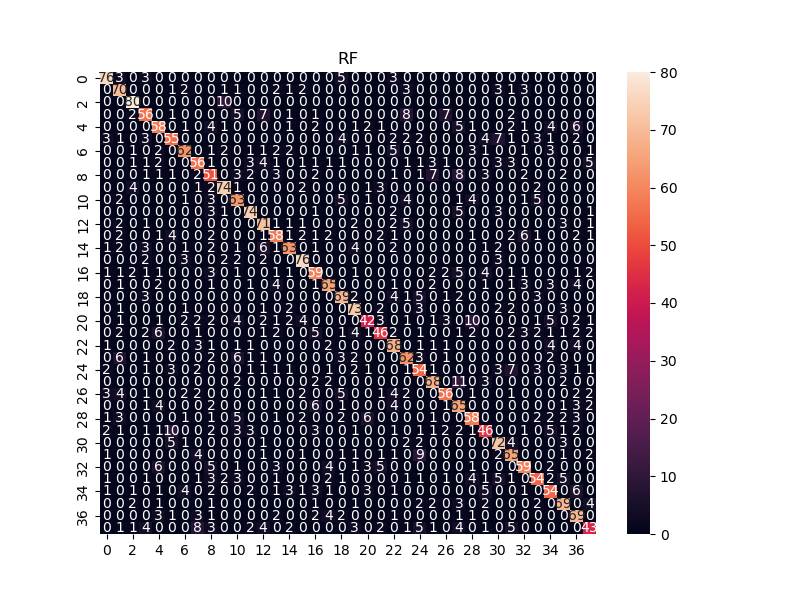
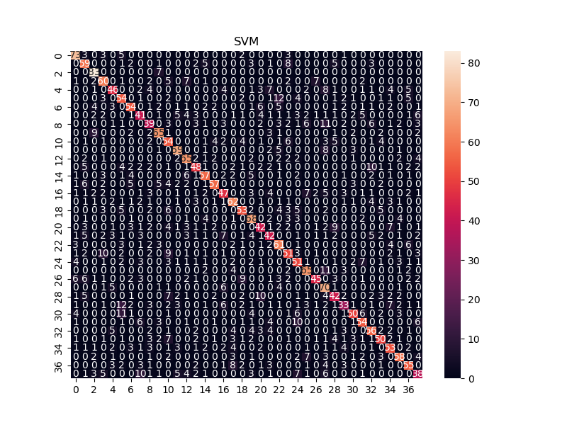
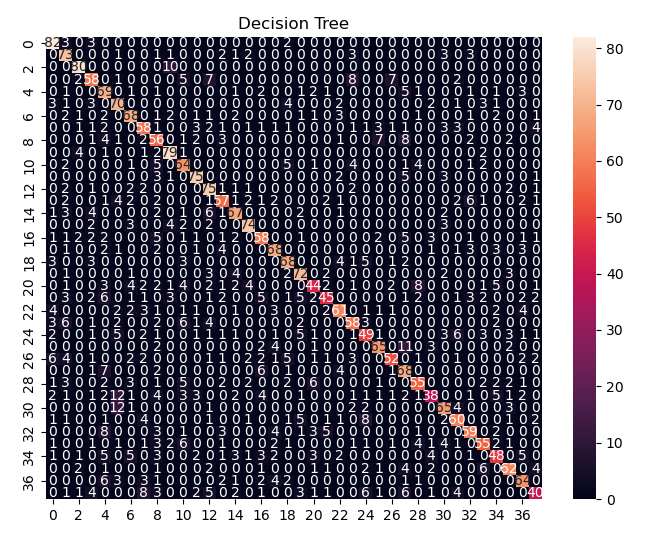
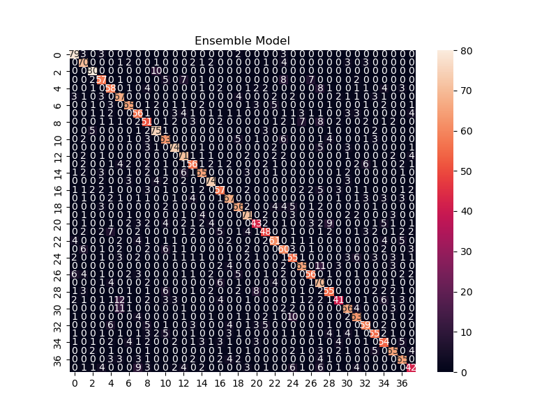

# Disease Prediction Model 🩺  


 
 
  

Machine learning model of clinical symptoms to determine likelihood of certain diseases using scikit-learn classification.

**Author:** Bernadette Burks  
**Date:** September 14, 2025  

---

## 📑 Table of Contents

- [Overview](#-overview)
- [Python Libraries](#-python-libraries)
- [Dataset Details](#-dataset-details)
- [Data Preparation & Cleaning](#-data-preparation--cleaning)
- [Model Training Methods](#-model-training-methods)
- [Model Evaluation](#-model-evaluation)
- [Example Prediction Workflow](#-example-prediction-workflow)
- [Results](#-results)
- [Key Skills Demonstrated](#-key-skills-demonstrated)
- [Future Improvements](#-future-improvements)
- [Project Structure](#-project-structure)
- [References](#-references)

---

## 📌 Overview

This **Disease Prediction Model** is based on a GeeksforGeeks tutorial:  
https://www.geeksforgeeks.org/machine-learning/disease-prediction-using-machine-learning/

The primary goal of this model is to explore how machine learning can assist in identifying diseases based on symptom patterns in datasets. 

---

## 📚 Python Libraries

This project incorporates several foundational libraries widely used in data science workflows:

- **Pandas** – Provides efficient data structures and visualization support built on NumPy.  
- **NumPy** – Enables fast numerical operations and compact dataset handling.  
- **SciPy** – Extends NumPy with additional scientific computing functionality.  
- **Matplotlib** – Offers highly customizable plotting tools compatible with most ML libraries.  
- **Seaborn** – Builds upon Matplotlib for more complex statistical visualizations.  
- **Scikit-learn** – Supplies integrated machine learning algorithms and model evaluation tools.

---

## 🗂 Dataset Details

The dataset used in this project is entitled **improved_disease_dataset** and contains a single file with **2,000 total entries**.

### Features Included

The dataset consists of symptom-based predictor variables, including:

- fever  
- headache  
- nausea  
- vomiting  
- fatigue  
- joint_pain  
- skin_rash  
- cough  
- weight_loss  
- yellow_eyes  

The outcome variable is:

- **disease** (the predicted diagnosis)

---

### 📊 Training & Validation Approach

This dataset is cross-validated using **5-fold stratified k-fold validation**, which defaults to:

- **80% training data (4 folds)**
- **20% validation/testing data (1 fold)**

This results in:

- Training set: **1,600 rows**
- Validation set: **400 rows**

---

## 🧹 Data Preparation & Cleaning

A recommended preprocessing step involves converting disease labels into numeric values to support early visualization and detection of class imbalance. Additionally, because certain disease categories were underrepresented, the dataset benefits from applying **RandomOverSampler**.

---

## 🧠 Model Training Methods

For cross-validation, the project evaluates three primary machine learning classifiers:

- `DecisionTreeClassifier()`  
- `RandomForestClassifier()`  
- `SVC()`  

*Note: I found an error in the original author's code during the confusion matrix evaluation stage: the `DecisionTreeClassifier()` appears to be replaced with `GaussianNB()`. I fixed this in my version of the assignment.*

---

## 📈 Model Evaluation

The project produces a final predictive function, **predict_disease**, which accepts symptom inputs and outputs a predicted diagnosis.

Across the trained models, two of three classifiers (67%) produced the same disease prediction given identical symptom sets.

While this performance level would require significant improvement before clinical deployment, it serves as a strong educational foundation and demonstrates the potential for future refinement in healthcare-oriented machine learning applications given a more robust dataset.

---

## 🧪 Example Prediction Workflow

Once trained, the model can be used by inputting symptom features such as:

```python
predict_disease(
    fever=1,
    headache=1,
    nausea=0,
    vomiting=0,
    fatigue=1,
    joint_pain=0,
    skin_rash=0,
    cough=1,
    weight_loss=0,
    yellow_eyes=0
)
```
---

## 📊 Results

Model performance was evaluated using confusion matrices and cross-validation accuracy.

### Confusion Matrix Comparison

| Model | Notes |
|------|------|
| Random Forest Classifier | Strong overall predictive consistency across symptom categories |
| Support Vector Classifier (SVC) | Performed similarly to Random Forest on majority classes |
| Decision Tree Classifier | Variance in outcome was likely skewed due to "noise" in dataset |









Confusion matrices provide insight into:

- Correct vs. incorrect disease classifications  
- Class-level prediction strengths  
- Potential areas of misclassification due to symptom overlap  

---

## 🛠 Key Skills Demonstrated

This project highlights several core machine learning and healthcare analytics skills:

- Data preprocessing and label encoding
- Handling class imbalance with oversampling
- Model training with cross-validation
- Comparing classifier performance
- Confusion matrix evaluation
- Applying ML concepts to clinical analysis

---

## 🚀 Future Improvements

This project serves as an excellent starting point for continued development. Future enhancements may include:

- Expanding evaluation metrics beyond accuracy (precision, recall, F1-score)
- Additional algorithms such as Gradient Boosting or XGBoost
- Feature importance tools for enhanced understanding
- Larger clinical datasets for stronger generalization
- Hosting the model via a GUI or dashboard

---

## 🔗 References

Disease Prediction Using Machine Learning. (2025). GeeksforGeeks. Retrieved September 14, 2025 from [https://www.geeksforgeeks.org/machine-learning/disease-prediction-using-machine-learning/](https://www.geeksforgeeks.org/machine-learning/disease-prediction-using-machine-learning/)

Ly, S. (2024). 8 Python Libraries You Must Know for Data Science. Simple Analytics. Retrieved September 14, 2025 from [https://simpleanalytics.co.nz/blogs/8-python-libraries-you-must-know-for-data-science](https://simpleanalytics.co.nz/blogs/8-python-libraries-you-must-know-for-data-science)

SciPy. (n.d.). Retrieved September 14, 2025 from [https://scipy.org/](https://scipy.org/)
